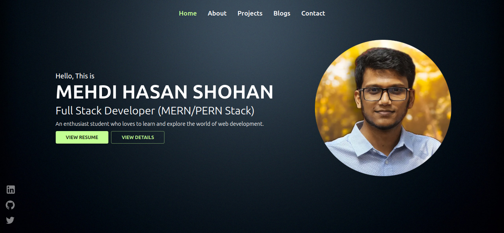

### Welcome to Mehdi Hasan Shohan's Portfolio...

**_As a passionate Full Stack Developer specializing in MERN stack technologies, I am enthosiastic about programing and have theoretical knowledge and practical experience to the world of web development. Currently pursuing my BSc engineering in Electrical and Electronic Engineering at Bangabandhu Sheikh Mujibur Rahman Science and Technology University, Gopalganj, Bangladesh._**

**_My technical skills include TypeScript and JavaScript for programming, MongoDB and PostgreSQL for databases, and Node.js with Express.js for backend development. On the front end, I'm proficient with React, Next.js, Redux-toolkit, and various UI libraries like Material-UI, TailwindCSS, and Ant Design._**

**_As a continuous learner, I'm always excited to explore new technologies and methodologies in the ever-evolving landscape of web development. I'm eager to contribute my skills and passion to innovative projects and collaborate with forward-thinking teams to create impactful digital solutions._**

### Skills

- **_Language_** : TypeScript, JavaScript
- **_Database_** : MongoDB, PostgreSQL, Redis
- **_Backend_** : Node.js, Express.Js, Mongoose, Prisma
- **_Frontend_** : React, Next.js, Redux-toolkit, MUI, TailwindCSS, Ant Design, Tanstack Query, Zustand
- **_Tools_** : Git, Docker, Postman, VS Code

### Interested In: Software Engineering, System Design..!!!

# Live Site: https://mhshohan.vercel.app

